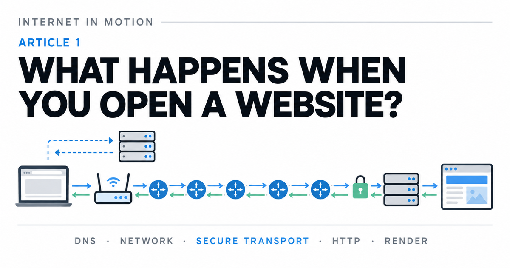

# Internet in Motion — Article 1

**What Happens When You Open a Website?** is the first article in *Internet in Motion*, a visual series about the systems behind everyday Internet activity. This guided introduction follows the events from entering a web address through DNS, local networking, routing, secure transport, HTTP responses, and browser rendering.

**[Start the interactive lesson](https://daniissac.com/internet-in-motion/)** · [View the source](https://github.com/daniissac/internet-in-motion)

[](https://daniissac.com/internet-in-motion/)

The experience first teaches the networking building blocks and then puts them into the chronological workflow of a fresh website visit. Learners can step through the journey, make predictions, change network conditions, and replay scenes at their own pace.

The workflow makes DNS explicit: after someone enters a site name, the browser and operating system check for a reusable address. If none is available, the device asks a DNS resolver for an IP address before starting a new connection to the website. DNS queries and answers are themselves carried in packets over local links and routed networks.

## The series

Article 1 provides the end-to-end map. Planned articles will examine individual parts in greater depth without repeating the complete introductory journey:

1. **What Happens When You Open a Website?** — the current visual overview.
2. **How DNS Finds a Website** — caches, recursive resolution, authoritative answers, TTLs, and failures.
3. **How Your Device Reaches the Internet** — Wi-Fi, Ethernet, local frames, addressing, gateways, and NAT.
4. **How Packets Cross Multiple Networks** — router hops, autonomous systems, peering, BGP, and path changes.
5. **How Browsers Create Secure Connections** — TCP, TLS 1.3, QUIC, HTTP versions, and connection reuse.
6. **How an HTTP Response Becomes a Web Page** — resource discovery, parsing, layout, painting, and progressive rendering.
7. **Why Websites Feel Fast or Slow** — latency, bandwidth, loss, jitter, congestion, caching, and browser waterfalls.

Future articles will live alongside this one in the same repository and reuse its visual language and dependency-free HTML, CSS, and JavaScript foundation.

## The learning journey

The single-page lesson contains eight connected chapters:

1. **Network** — devices exchange information over connections.
2. **Local network** — Wi-Fi or Ethernet links a device to a local gateway.
3. **Packets** — IP carries best-effort packets; reliable transports can recover missing data when required.
4. **IP and DNS** — before a new site connection, a domain name can be resolved to one or more current addresses.
5. **Routing** — routers choose next hops and can use an alternate path after routes update.
6. **Secure web delivery** — TCP with TLS and QUIC establish protected transport for HTTP traffic; optional detail explains how QUIC builds on UDP.
7. **Opening a website** — DNS, secure transport, HTTP requests, responses, and rendering work together.
8. **Performance** — latency, available bandwidth, loss, jitter, DNS caching, transport, and route recovery shape the experience in different ways.

Chapter 8 recombines the ideas in an interactive network-time model. Learners can change DNS caching, path availability, an assumed route-recovery delay, transport, latency, bandwidth, loss, and jitter, then read the resulting event log. One-change experiment presets make the comparisons repeatable. Its result is modeled network time, not a full page-load prediction.

## Learning design

- Motion and explanation stay close together.
- The site distinguishes its concept-first teaching order from the real event order shown in the website workflow.
- One journey thread connects the individual chapters into a causal story without implying that a single packet is reused end to end.
- Prediction checks give immediate, explanatory feedback.
- Motion respects reduced-motion preferences, demonstrations can be replayed, and guided sequences can be stepped through manually.
- Simulations call out simplifications instead of presenting one path or timing result as universal.

The site is designed for first-time learners. Technical terms are introduced in context, while optional detail remains available through the interactive scenes.

## Technical notes

Internet behavior varies by device, network, protocol, location, cache state, and time. Values shown in the site are illustrative teaching examples rather than measurements. DNS answers can change, routes are not guaranteed to be symmetric, and browsers may reuse cached answers, files, or existing connections.

The site is plain HTML, CSS, and JavaScript. It has no packages, framework, compilation step, runtime data service, or third-party browser asset. GitHub Pages publishes the source files directly.

Its light editorial interface follows the same compact reading system as Dani Issac's current portfolio: a 780 px reading column, system typography, white canvas, thin rules, blue links, and restrained left-rule feature blocks. The networking diagrams retain only the extra structure needed to make protocol behavior visible.

## Accessibility

The experience uses native buttons, links, form controls, visible focus states, live status updates, and descriptive labels. It respects reduced-motion preferences and provides manual controls for replaying demonstrations and stepping through guided sequences.

## Run locally

```bash
python3 -m http.server 8000
```

Open `http://localhost:8000`.

## Verify

The checks use Node.js's built-in test runner and install nothing:

```bash
node --test tests/static-export.test.mjs
node --check script.js
```

## Contributing

Bug reports, corrections, and ideas for new learning interactions are welcome through [GitHub Issues](https://github.com/daniissac/internet-in-motion/issues).

## License

[MIT](LICENSE)
